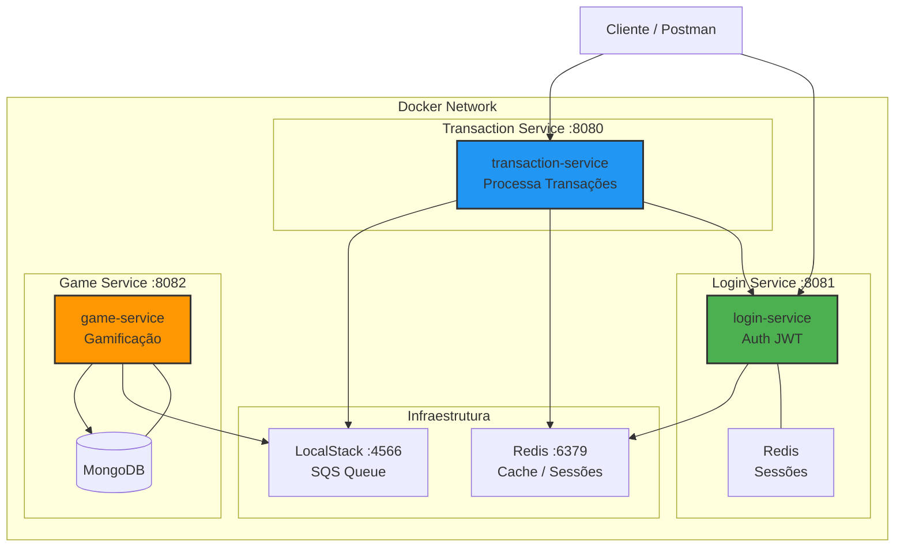

# Itau Microservices Platform — TransactionService

<p align="center">
  
  
  
  
  
</p>

## 📋 Visão Geral da Plataforma

**Nome:** Itau Microservices Platform  
**Propósito:** Plataforma de processamento de transações gamificadas, onde usuários realizam operações financeiras que são consumidas por um sistema de jogos.

**Problema que resolve:**
- Processamento seguro de transações financeiras
- Autenticação centralizada via JWT
- Processamento assíncrono via SQS
- Gamificação para engajamento do usuário

**Principais Funcionalidades:**
- ✅ Autenticação e autorização com JWT
- ✅ CRUD de transações financeiras
- ✅ Processamento assíncrono via filas SQS
- ✅ Sistema de gamificação (níveis, missões)
- ✅ Rate limiting por IP
- ✅ Circuit breaker para resiliência

**Tecnologias:**
- Java 21, Spring Boot 3.3.5, Spring Security, Spring Data JPA
- Redis (sessões, rate limiting), MongoDB (gamificação), H2 (testes)
- AWS SQS (LocalStack), Docker, Maven, JWT, Resilience4j

---

## 🏗️ Arquitetura da Plataforma



---

Microsserviço de **processamento de transações financeiras**, desenvolvido em Java 21 com Spring Boot 3.3.5. Recebe requisições autenticadas via JWT, valida o cliente junto ao **LoginService**, e publica os eventos de transação em uma fila **AWS SQS**.

---

## 📐 Arquitetura

```
                          ┌─────────────────────────────────────────────────────────┐
                          │                   TransactionService                    │
                          │                                                         │
  Client (MOBILE)         │  ┌─────────────────┐     ┌──────────────────────────┐  │
  ──────────────────────► │  │  JWT Filter      │────►│  TransactionController   │  │
  POST /transactions       │  │  (Spring Sec.)   │     │  POST /transactions      │  │
  Authorization: Bearer    │  └─────────────────┘     └────────────┬─────────────┘  │
                          │                                         │               │
                          │                            ┌────────────▼─────────────┐ │
                          │                            │   TransactionService     │ │
                          │                            │  ┌─────────────────────┐ │ │
                          │                            │  │ TransactionValidator │ │ │
                          │                            │  └─────────────────────┘ │ │
                          │                            └──────┬───────────┬───────┘ │
                          │                                   │           │         │
                          │               ┌───────────────────┘           │         │
                          │               ▼                               ▼         │
                          │  ┌────────────────────────┐    ┌─────────────────────┐ │
                          │  │      LoginClient        │    │     SqsProducer     │ │
                          │  │  CircuitBreaker + Retry │    │                     │ │
                          │  └────────────┬────────────┘    └──────────┬──────────┘ │
                          └──────────────┼──────────────────────────────┼────────────┘
                                         │                              │
                              ┌──────────▼──────────┐      ┌───────────▼──────────┐
                              │    LoginService       │      │      AWS SQS         │
                              │  GET /me              │      │  queue: transactions  │
                              │  (WireMock em Docker) │      │  (LocalStack)         │
                              └──────────────────────┘      └──────────────────────┘
```

### Fluxo de uma transação

```
1. Cliente envia POST /transactions com JWT no header Authorization
2. JwtAuthenticationFilter valida o token e extrai customerId + channel
3. TransactionController delega ao TransactionService
4. TransactionValidator valida tipo e valor da transação
5. Verifica se o canal é MOBILE (único canal permitido)
6. LoginClient chama GET /me no LoginService para validar a sessão ativa
   - CircuitBreaker abre após 50% de falhas (janela de 10 chamadas)
   - Retry com backoff exponencial (3 tentativas, 500ms inicial)
   - Fallback: bloqueia a transação (fail-fast) ou permite sem validação (fail-open)
7. Verifica se o cliente possui contractService = true
8. SqsProducer publica o TransactionEvent na fila SQS
9. Retorna HTTP 202 ACCEPTED com o TransactionResponse
```

---

## 🚀 Tecnologias

| Tecnologia | Versão | Uso |
|---|---|---|
| Java | 21 | Linguagem principal |
| Spring Boot | 3.3.5 | Framework base |
| Spring Security | 6.x | Autenticação JWT stateless |
| Spring WebFlux (WebClient) | 6.x | Chamadas HTTP reativas ao LoginService |
| JJWT | 0.12.6 | Parsing e validação de JWT |
| Resilience4j | 2.2.0 | CircuitBreaker e Retry no LoginClient |
| AWS SDK v2 (SQS) | 2.29.50 | Publicação de eventos na fila SQS |
| Micrometer + Prometheus | — | Métricas de negócio e performance |
| Logstash Logback Encoder | 8.0 | Logs estruturados em JSON |
| WireMock | 3.3.1 | Mock do LoginService em testes e Docker |
| LocalStack | 3.0 | Emulação local do AWS SQS |
| Lombok | — | Redução de boilerplate |
| Docker / Docker Compose | — | Containerização e ambiente local |

---

## 📦 Estrutura do Projeto

```
src/
└── main/
    └── java/com/transactionservice/
        ├── TransactionServiceApplication.java   # Ponto de entrada
        ├── controller/
        │   ├── TransactionController.java       # POST /transactions
        │   └── GlobalExceptionHandler.java      # Tratamento centralizado de erros
        ├── service/
        │   ├── TransactionService.java          # Orquestração do fluxo de transação
        │   └── TransactionValidator.java        # Validações de negócio (tipo, valor)
        ├── domain/
        │   └── TransactionType.java             # Enum: PIX, PAGAMENTO, RECEBIMENTO, CARTAO, INVESTIMENTO
        ├── dto/
        │   ├── TransactionRequest.java          # Payload de entrada
        │   ├── TransactionResponse.java         # Payload de saída
        │   ├── TransactionEvent.java            # Evento publicado no SQS
        │   ├── SessionDTO.java                  # Resposta do LoginService
        │   └── ErrorResponse.java              # Formato padronizado de erros
        ├── exception/
        │   ├── BusinessException.java           # Erros de regra de negócio (4xx)
        │   ├── UnauthorizedException.java       # Autenticação inválida (401)
        │   └── LoginServiceUnavailableException.java # LoginService indisponível
        └── infrastructure/
            ├── client/
            │   ├── LoginClient.java             # HTTP Client com CircuitBreaker/Retry
            │   └── WebClientConfig.java         # Configuração do WebClient
            ├── security/
            │   ├── SecurityConfig.java          # Filtros e regras de acesso
            │   ├── JwtAuthenticationFilter.java # Interceptor JWT
            │   ├── JwtTokenProvider.java        # Parse e validação do token
            │   └── JwtDetails.java             # Detalhes extras do token (channel, etc.)
            └── sqs/
                ├── SqsConfig.java               # Configuração do SqsClient
                └── SqsProducer.java             # Publicação de eventos na fila
```

---

## ⚙️ Variáveis de Ambiente

| Variável | Padrão (local) | Descrição |
|---|---|---|
| `JWT_SECRET` | `bXlTdXBlclNlY3JldEtleUZvckpXVFRva2VuR2VuZXJhdGlvbjEyMzQ1Njc4OTA=` | Chave Base64 para validação do JWT |
| `LOGIN_SERVICE_URL` | `http://localhost:8081` | URL base do LoginService |
| `LOGIN_SERVICE_TIMEOUT_MILLIS` | `2000` | Timeout (ms) nas chamadas ao LoginService |
| `LOGIN_SERVICE_FAIL_FAST` | `true` | `true` = bloqueia transação se LoginService falhar |
| `SQS_QUEUE_URL` | `http://localhost:4566/000000000000/transactions` | URL da fila SQS |
| `AWS_REGION` | `us-east-1` | Região AWS |
| `AWS_ENDPOINT` | `http://localhost:4566` | Endpoint SQS (LocalStack em dev) |
| `AWS_ACCESS_KEY_ID` | `test` | Chave de acesso AWS |
| `AWS_SECRET_ACCESS_KEY` | `test` | Chave secreta AWS |

---

## 🔌 API

### `POST /transactions`

Processa uma transação financeira. Requer autenticação JWT com canal `MOBILE`.

**Request Headers**

| Header | Obrigatório | Descrição |
|---|---|---|
| `Authorization` | ✅ | `Bearer <jwt_token>` |
| `Content-Type` | ✅ | `application/json` |

**Request Body**

```json
{
  "type": "PIX",
  "amount": 150.00
}
```

| Campo | Tipo | Obrigatório | Descrição |
|---|---|---|---|
| `type` | `TransactionType` | ✅ | Tipo da transação: `PIX`, `PAGAMENTO`, `RECEBIMENTO`, `CARTAO`, `INVESTIMENTO` |
| `amount` | `BigDecimal` | ✅ | Valor da transação (mínimo: `0.01`, máximo: `1000000.00`) |

**Response `202 Accepted`**

```json
{
  "transactionId": "a3f9c1e2-4b2a-4d7e-9f1a-123456789abc",
  "customerId": "customer-123",
  "type": "PIX",
  "amount": 150.00,
  "status": "ACCEPTED",
  "timestamp": "2025-04-24T20:00:00Z"
}
```

**Respostas de Erro**

| Status | Cenário |
|---|---|
| `400 Bad Request` | Payload inválido (campo ausente, valor inválido, tipo desconhecido) |
| `401 Unauthorized` | Token JWT ausente, inválido ou expirado |
| `403 Forbidden` | Canal diferente de `MOBILE` ou cliente sem serviço contratado |
| `503 Service Unavailable` | LoginService indisponível e `LOGIN_SERVICE_FAIL_FAST=true` |

---

## 🛡️ Segurança e Resiliência

### Autenticação JWT

- Todos os endpoints de transação requerem `Authorization: Bearer <token>`
- O filtro `JwtAuthenticationFilter` extrai `customerId` (subject), `channel` e `roles` do token
- Sessão completamente stateless (sem HttpSession)

### CircuitBreaker (LoginService)

| Parâmetro | Valor |
|---|---|
| Janela deslizante | 10 chamadas |
| Mínimo de chamadas | 5 |
| Threshold de falhas | 50% |
| Tempo em estado OPEN | 30 segundos |
| Chamadas em HALF-OPEN | 3 |

### Retry (LoginService)

| Parâmetro | Valor |
|---|---|
| Máximo de tentativas | 3 |
| Espera inicial | 500ms |
| Backoff exponencial | 2x |

### Fail-Fast vs Fail-Open

Controlado pela variável `LOGIN_SERVICE_FAIL_FAST`:

- **`true` (padrão):** Se o LoginService estiver indisponível, a transação é **bloqueada** (mais seguro)
- **`false`:** A transação é **permitida** mesmo sem validação de sessão (modo fail-open, maior risco)

---

## 📊 Observabilidade

### Métricas (Prometheus)

| Métrica | Descrição |
|---|---|
| `transactions.total` | Total de transações processadas com sucesso |
| `transactions.failures` | Total de transações rejeitadas/com erro |
| `login.service.request.duration` | Duração das chamadas ao LoginService |

Acesse em: `GET /actuator/prometheus`

### Health Check

```
GET /actuator/health
```

Inclui estado do CircuitBreaker do LoginService.

### Endpoints de Actuator expostos

`health`, `info`, `prometheus`, `metrics`, `circuitbreakers`, `retries`

---

## 🐳 Como Executar

### Pré-requisitos

- [Docker](https://www.docker.com/) e [Docker Compose](https://docs.docker.com/compose/)
- [Java 21+](https://adoptium.net/) *(apenas para execução local sem Docker)*
- [Maven 3.9+](https://maven.apache.org/) *(apenas para execução local sem Docker)*

### 1. Subir com Docker Compose (recomendado)

O ambiente completo inclui:
- `transaction-service` (porta `8080`)
- `localstack` — AWS SQS local (porta `4566`)
- `login-service-mock` — WireMock simulando o LoginService (porta `8081`)

```bash
docker-compose up --build
```

Aguarde o health check do `transaction-service` ficar `healthy`.

### 2. Executar localmente (sem Docker)

**a) Suba o LocalStack e o WireMock:**

```bash
docker-compose up localstack login-service-mock
```

**b) Build do projeto:**

```bash
mvn clean package -DskipTests
```

**c) Execute a aplicação:**

```bash
java -jar target/transaction-service-1.0.0.jar
```

---

## 🧪 Testes

```bash
mvn test -Dspring.profiles.active=test
```

Os testes utilizam WireMock para mockar as chamadas ao LoginService e um perfil de teste (`application-test.yml`) com configurações isoladas.

---

## 🔧 Exemplo de Requisição

Gere um JWT de teste com `channel: MOBILE` e use-o na requisição abaixo:

```bash
curl -X POST http://localhost:8080/transactions \
  -H "Content-Type: application/json" \
  -H "Authorization: Bearer <seu_jwt_aqui>" \
  -d '{
    "type": "PIX",
    "amount": 250.00
  }'
```

**Resposta esperada (`202 Accepted`):**

```json
{
  "transactionId": "a3f9c1e2-4b2a-4d7e-9f1a-123456789abc",
  "customerId": "customer-123",
  "type": "PIX",
  "amount": 250.00,
  "status": "ACCEPTED",
  "timestamp": "2025-04-24T20:00:00Z"
}
```

---

## 📝 Licença

Este projeto é de uso interno e fins educacionais.