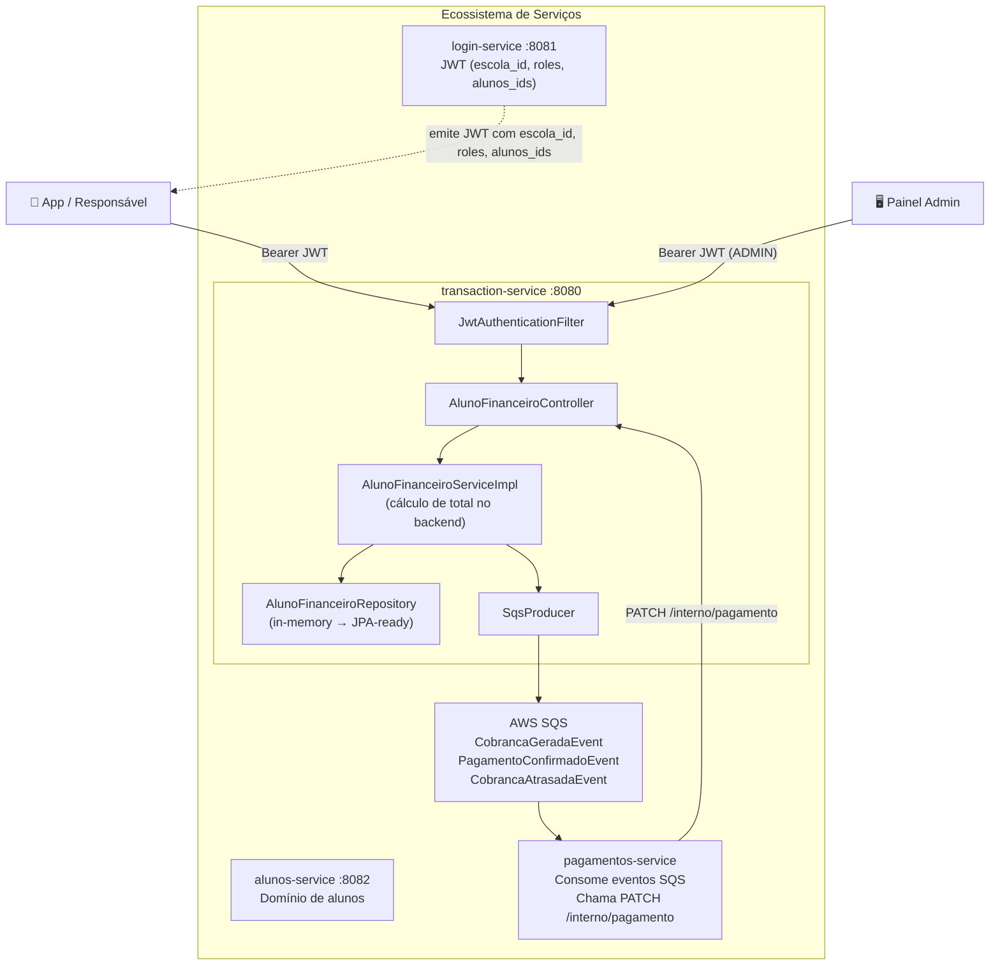

# 💰 financeiro-service (transaction-service)

<p align="center">
  
  
  
  
  
  
  
</p>

Microsserviço de **domínio financeiro (cobranças de alunos)**, desenvolvido em **Java 21** com **Spring Boot 3.3.5**. Responsável pela geração, controle de status e publicação de eventos de cobranças mensais no ecossistema de gestão escolar.

---

## 📑 Sumário

1. [Visão Geral do Projeto](#1-visão-geral-do-projeto)
2. [Arquitetura do Ecossistema](#2-arquitetura-do-ecossistema)
3. [Modelo de Dados](#3-modelo-de-dados)
4. [Endpoints REST](#4-endpoints-rest)
5. [Segurança e Multi-tenancy](#5-segurança-e-multi-tenancy)
6. [Eventos SQS](#6-eventos-sqs)
7. [Integração com pagamentos-service](#7-integração-com-pagamentos-service)
8. [Como Subir o Projeto (Docker)](#8-como-subir-o-projeto-docker)
9. [Exemplos de Request/Response](#9-exemplos-de-requestresponse)
10. [Estrutura de Pastas](#10-estrutura-de-pastas)
11. [Variáveis de Ambiente](#11-variáveis-de-ambiente)
12. [Observabilidade](#12-observabilidade)

---

## 1. Visão Geral do Projeto

### Nome e propósito

| Campo | Valor |
|---|---|
| **artifactId** | `transaction-service` |
| **groupId** | `com.transactionservice` |
| **version** | `1.0.0` |
| **responsabilidade** | Domínio financeiro — cobranças mensais de alunos |

Este serviço é responsável por:

- **Gerar cobranças mensais** para alunos (mensalidade + alimentação + multa + juros)
- **Calcular totais** exclusivamente no backend (nunca confiar no cliente)
- **Controlar status** de cobranças: `PENDENTE`, `PAGO`, `ATRASADO`
- **Publicar eventos SQS** para integração com `pagamentos-service`
- **Garantir multi-tenancy** via `escolaId` extraído do JWT
- **Validar acesso por roles**: `ADMIN` tem acesso total; `RESPONSAVEL` só acessa seus alunos vinculados

### Posição no Ecossistema

| Serviço | Responsabilidade |
|---|---|
| `login-service` | Autenticação e emissão de JWT |
| `alunos-service` | Domínio de alunos e matrículas |
| **`transaction-service`** | **Domínio financeiro — cobranças** |
| `pagamentos-service` | Processamento de pagamentos |

### Principais funcionalidades

| Funcionalidade | Endpoint | Descrição |
|---|---|---|
| Consultar cobranças por aluno | `GET /api/v1/financeiro/{alunoId}` | Lista cobranças com filtro opcional por mês |
| Consultar por query params | `GET /api/v1/financeiro?alunoId=&mes=` | Mesma consulta via parâmetros de query |
| Gerar cobrança mensal | `POST /api/v1/financeiro/gerar-mensal` | Cria cobrança com total calculado no backend |
| Registrar pagamento (interno) | `PATCH /api/v1/financeiro/{id}/interno/pagamento` | Atualiza status — uso do `pagamentos-service` |

---

## 2. Arquitetura do Ecossistema



### Arquitetura Hexagonal

O projeto segue arquitetura hexagonal (ports & adapters):

```
domain  ports (interfaces)   adapters (implementações)
  ↓           ↓                       ↓
financeiro/  domains/             adapters/
entity/      SqsProducerDomain    SqsProducerAdapter
event/       LoginClientDomain    LoginClientAdapter
service/                         infrastructure/sqs/SqsProducer
                                 infrastructure/client/LoginClient
```

---

## 3. Modelo de Dados

### `AlunoFinanceiroEntity`

| Campo | Tipo | Descrição |
|---|---|---|
| `id` | `Long` | Identificador único (auto-increment) |
| `alunoId` | `Long` | ID do aluno (referência externa ao alunos-service) |
| `escolaId` | `Long` | ID da escola — impõe multi-tenancy |
| `mesReferencia` | `String` | Mês no formato `YYYY-MM` |
| `mensalidade` | `BigDecimal` | Valor da mensalidade |
| `alimentacao` | `BigDecimal` | Valor de alimentação |
| `multa` | `BigDecimal` | Multa por atraso (default 0) |
| `juros` | `BigDecimal` | Juros por atraso (default 0) |
| `total` | `BigDecimal` | **Calculado no backend**: mensalidade + alimentacao + multa + juros |
| `status` | `StatusFinanceiro` | `PENDENTE`, `PAGO` ou `ATRASADO` |
| `dataGeracao` | `LocalDateTime` | Data de criação da cobrança |
| `dataAtualizacao` | `LocalDateTime` | Data da última atualização |

> ⚠️ **Regra de segurança crítica**: `total` e `escolaId` **nunca** são aceitos no request body. O `total` é sempre calculado pelo backend; o `escolaId` é sempre extraído do JWT.

### `StatusFinanceiro`

```
PENDENTE → aguardando pagamento
PAGO     → pagamento confirmado
ATRASADO → vencido sem pagamento
```

---

## 4. Endpoints REST

### `GET /api/v1/financeiro/{alunoId}?mes=YYYY-MM`

Consulta cobranças de um aluno. O parâmetro `mes` é opcional.

- **Roles permitidas**: `ADMIN` (todos os alunos), `RESPONSAVEL` (apenas alunos vinculados no JWT)
- **Multi-tenancy**: filtra automaticamente pelo `escolaId` do JWT

**Response 200:**
```json
[
  {
    "id": 1,
    "alunoId": 42,
    "escolaId": 10,
    "mesReferencia": "2025-05",
    "mensalidade": 500.00,
    "alimentacao": 100.00,
    "multa": 0.00,
    "juros": 0.00,
    "total": 600.00,
    "status": "PENDENTE",
    "dataGeracao": "2025-05-01T10:00:00",
    "dataAtualizacao": "2025-05-01T10:00:00"
  }
]
```

---

### `GET /api/v1/financeiro?alunoId=42&mes=2025-05`

Mesma consulta via query parameters. Comportamento idêntico ao endpoint acima.

---

### `POST /api/v1/financeiro/gerar-mensal`

Gera uma nova cobrança mensal. **Restrito a `ADMIN`.**

**Request body:**
```json
{
  "alunoId": 42,
  "mesReferencia": "2025-05",
  "mensalidade": 500.00,
  "alimentacao": 100.00,
  "multa": 10.00,
  "juros": 5.00
}
```

> `multa` e `juros` são opcionais (default `0`).  
> `total` e `escolaId` **não são aceitos** — calculados/extraídos pelo backend.

**Response 201:**
```json
{
  "id": 1,
  "alunoId": 42,
  "escolaId": 10,
  "mesReferencia": "2025-05",
  "mensalidade": 500.00,
  "alimentacao": 100.00,
  "multa": 10.00,
  "juros": 5.00,
  "total": 615.00,
  "status": "PENDENTE",
  "dataGeracao": "2025-05-01T10:00:00",
  "dataAtualizacao": "2025-05-01T10:00:00"
}
```

Após a criação, o evento `CobrancaGeradaEvent` é publicado no SQS.

---

### `PATCH /api/v1/financeiro/{id}/interno/pagamento`

Atualiza o status de uma cobrança. **Restrito a `ADMIN`.**  
Endpoint consumido pelo `pagamentos-service` para confirmar ou marcar atrasos.

**Request body:**
```json
{
  "status": "PAGO"
}
```

Valores aceitos: `PENDENTE`, `PAGO`, `ATRASADO`.

**Response 200:** mesmo formato do response da consulta.

Após atualização:
- Status `PAGO` → publica `PagamentoConfirmadoEvent`
- Status `ATRASADO` → publica `CobrancaAtrasadaEvent`

---

## 5. Segurança e Multi-tenancy

### JWT Claims utilizados

| Claim | Tipo | Uso |
|---|---|---|
| `sub` | `String` | Identificador do usuário autenticado |
| `roles` | `List<String>` | `ADMIN` ou `RESPONSAVEL` |
| `escola_id` | `Long` | Impõe multi-tenancy (nunca aceito no request) |
| `alunos_ids` | `List<Long>` | IDs dos alunos vinculados ao responsável |

### Regras de Acesso

```
ADMIN     → acesso total a todos os alunos da escola (filtrado por escolaId do JWT)
RESPONSAVEL → acesso restrito aos alunos listados em alunos_ids no JWT
```

### Validação `validarAcessoAluno`

Implementada em `AlunoFinanceiroAccessControl`:

1. Se `roles` contém `ADMIN` → permite acesso.
2. Se `RESPONSAVEL` → verifica se `alunoId` está em `alunos_ids` do JWT.
3. Caso contrário → lança `AccessDeniedException` (HTTP 403).

### Multi-tenancy

- `escolaId` é **sempre** extraído do JWT via claim `escola_id`.
- **Nunca** é aceito no request body ou como parâmetro de URL.
- Todas as queries ao repositório incluem `escolaId` como filtro obrigatório.

---

## 6. Eventos SQS

O serviço publica eventos no AWS SQS para integração assíncrona.

### `CobrancaGeradaEvent`

Publicado quando uma nova cobrança é gerada via `POST /gerar-mensal`.

```json
{
  "eventId": "uuid",
  "escolaId": 10,
  "alunoId": 42,
  "cobrancaId": 1,
  "mesReferencia": "2025-05",
  "total": 615.00,
  "timestamp": "2025-05-01T10:00:00Z"
}
```

### `PagamentoConfirmadoEvent`

Publicado quando uma cobrança é marcada como `PAGO`.

```json
{
  "eventId": "uuid",
  "escolaId": 10,
  "alunoId": 42,
  "cobrancaId": 1,
  "mesReferencia": "2025-05",
  "timestamp": "2025-05-10T14:30:00Z"
}
```

### `CobrancaAtrasadaEvent`

Publicado quando uma cobrança é marcada como `ATRASADO`.

```json
{
  "eventId": "uuid",
  "escolaId": 10,
  "alunoId": 42,
  "cobrancaId": 1,
  "mesReferencia": "2025-05",
  "total": 615.00,
  "timestamp": "2025-06-01T09:00:00Z"
}
```

Todos os eventos implementam `FinanceiroBaseEvent` e incluem os atributos de mensagem SQS `eventType` e `escolaId`.

---

## 7. Integração com pagamentos-service

O `pagamentos-service` se integra com este serviço de duas formas:

1. **Consumindo eventos SQS**: escuta `CobrancaGeradaEvent` para iniciar o fluxo de pagamento.
2. **Chamando o endpoint interno** após confirmação de pagamento:

```
PATCH /api/v1/financeiro/{id}/interno/pagamento
Authorization: Bearer <jwt-admin>
Content-Type: application/json

{ "status": "PAGO" }
```

Esse endpoint requer um JWT com role `ADMIN` — o `pagamentos-service` deve autenticar via `login-service` e obter um token administrativo.

---

## 8. Como Subir o Projeto (Docker)

### Pré-requisitos

- Docker e Docker Compose instalados
- Variáveis de ambiente configuradas (ver seção 11)

### Subir o ambiente completo

```bash
docker-compose up -d
```

Isso inicia:
- `transaction-service` na porta `8080`
- `localstack` (emulação AWS SQS) na porta `4566`
- `wiremock` (mock do login-service) na porta `8081`

### Criar a fila SQS no LocalStack

```bash
./scripts/setup-localstack.sh
```

### Verificar saúde

```bash
curl http://localhost:8080/actuator/health
```

---

## 9. Exemplos de Request/Response

### Gerar cobrança mensal (ADMIN)

```bash
curl -X POST http://localhost:8080/api/v1/financeiro/gerar-mensal \
  -H "Authorization: Bearer $JWT_ADMIN" \
  -H "Content-Type: application/json" \
  -d '{
    "alunoId": 42,
    "mesReferencia": "2025-05",
    "mensalidade": 500.00,
    "alimentacao": 100.00
  }'
```

### Consultar cobranças (ADMIN ou RESPONSAVEL)

```bash
# Por path variable
curl http://localhost:8080/api/v1/financeiro/42?mes=2025-05 \
  -H "Authorization: Bearer $JWT_TOKEN"

# Por query param
curl "http://localhost:8080/api/v1/financeiro?alunoId=42&mes=2025-05" \
  -H "Authorization: Bearer $JWT_TOKEN"
```

### Registrar pagamento (uso interno pelo pagamentos-service)

```bash
curl -X PATCH http://localhost:8080/api/v1/financeiro/1/interno/pagamento \
  -H "Authorization: Bearer $JWT_ADMIN" \
  -H "Content-Type: application/json" \
  -d '{ "status": "PAGO" }'
```

### Respostas de erro

| Código | Cenário |
|---|---|
| `400` | Request body inválido (campos obrigatórios ausentes ou formato incorreto) |
| `401` | Token JWT ausente, inválido ou expirado |
| `403` | Role insuficiente (RESPONSAVEL acessando aluno não vinculado) |
| `422` | Regra de negócio violada (ex: cobrança duplicada para o mesmo mês) |
| `503` | Login-service indisponível (circuit breaker aberto) |

---

## 10. Estrutura de Pastas

```
src/main/java/com/transactionservice/
├── TransactionServiceApplication.java
├── adapters/                          # Adaptadores hexagonais
│   ├── LoginClientAdapter.java
│   └── SqsProducerAdapter.java
├── config/                            # Configurações gerais (Jackson, WebClient)
├── controller/                        # GlobalExceptionHandler
├── domains/                           # Ports (interfaces do domínio)
│   ├── LoginClientDomain.java
│   └── SqsProducerDomain.java
├── exception/                         # Exceções de domínio
├── financeiro/                        # Módulo financeiro (domínio principal)
│   ├── controller/
│   │   └── AlunoFinanceiroController.java
│   ├── domain/
│   │   └── StatusFinanceiro.java      # PENDENTE, PAGO, ATRASADO
│   ├── dto/
│   │   ├── AlunoFinanceiroResponse.java
│   │   ├── GerarMensalidadeRequest.java
│   │   └── PagamentoRequest.java
│   ├── entity/
│   │   └── AlunoFinanceiroEntity.java
│   ├── event/                         # Eventos SQS do domínio financeiro
│   │   ├── FinanceiroBaseEvent.java
│   │   ├── CobrancaGeradaEvent.java
│   │   ├── PagamentoConfirmadoEvent.java
│   │   └── CobrancaAtrasadaEvent.java
│   ├── repository/
│   │   └── AlunoFinanceiroRepository.java  # In-memory (ConcurrentHashMap)
│   ├── security/
│   │   └── AlunoFinanceiroAccessControl.java
│   └── service/
│       ├── AlunoFinanceiroService.java
│       └── AlunoFinanceiroServiceImpl.java
├── infrastructure/
│   ├── client/
│   │   └── LoginClient.java           # WebClient + CircuitBreaker + Retry
│   ├── security/
│   │   ├── JwtAuthenticationFilter.java
│   │   ├── JwtDetails.java
│   │   ├── JwtTokenProvider.java
│   │   └── SecurityConfig.java
│   └── sqs/
│       ├── SqsConfig.java
│       └── SqsProducer.java           # Resilience4j Retry
└── model/
    └── session/
        └── SessionDTO.java
```

---

## 11. Variáveis de Ambiente

| Variável | Default | Descrição |
|---|---|---|
| `JWT_SECRET` | — | **Obrigatório.** Chave secreta para validação JWT |
| `LOGIN_SERVICE_URL` | `http://login-service:8081` | URL do login-service |
| `LOGIN_SERVICE_TIMEOUT_MILLIS` | `2000` | Timeout para chamadas ao login-service |
| `LOGIN_SERVICE_FAIL_FAST` | `true` | Se `true`, bloqueia em caso de indisponibilidade |
| `SQS_QUEUE_URL` | — | **Obrigatório.** URL da fila SQS |
| `AWS_ENDPOINT` | `http://localstack:4566` | Endpoint AWS (LocalStack em dev) |
| `AWS_REGION` | `us-east-1` | Região AWS |
| `AWS_ACCESS_KEY_ID` | `test` | Credencial AWS (LocalStack usa `test`) |
| `AWS_SECRET_ACCESS_KEY` | `test` | Credencial AWS (LocalStack usa `test`) |

---

## 12. Observabilidade

### Health Check

```
GET /actuator/health
GET /actuator/info
```

### Métricas Prometheus

```
GET /actuator/prometheus
```

Métricas disponíveis:
- `financeiro.eventos.enviados.sqs` — eventos financeiros publicados no SQS
- `sqs.publish.duration` — latência de publicação no SQS
- Circuit Breaker do login-service (`loginService`)
- Retry do SQS (`sqsPublish`)

### Circuit Breaker

O `LoginClient` está protegido por Circuit Breaker + Retry (Resilience4j):
- **Circuit Breaker** `loginService`: abre após 50% de falhas em janela de 10 chamadas
- **Retry** `loginService`: até 3 tentativas com backoff exponencial (500ms base)
- **Retry** `sqsPublish`: até 3 tentativas para falhas transitórias no SQS
