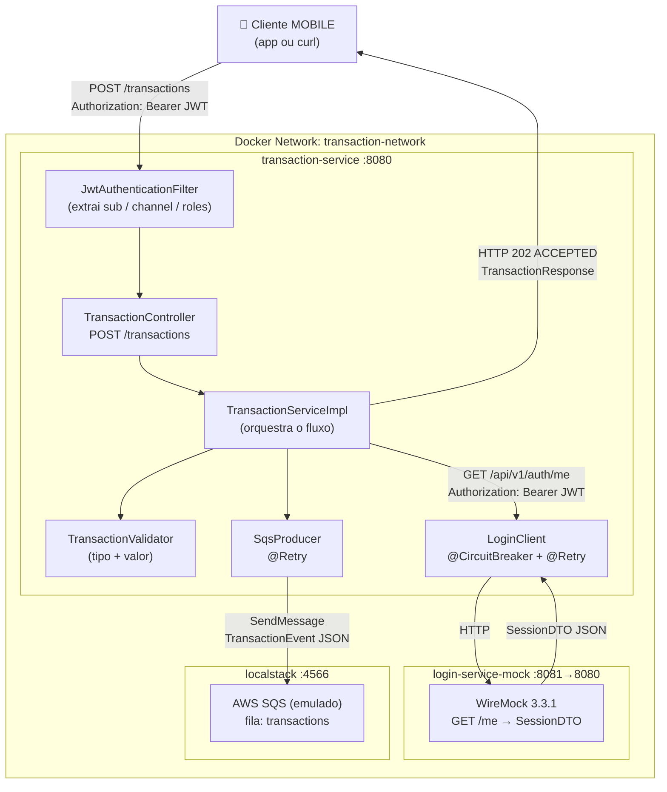
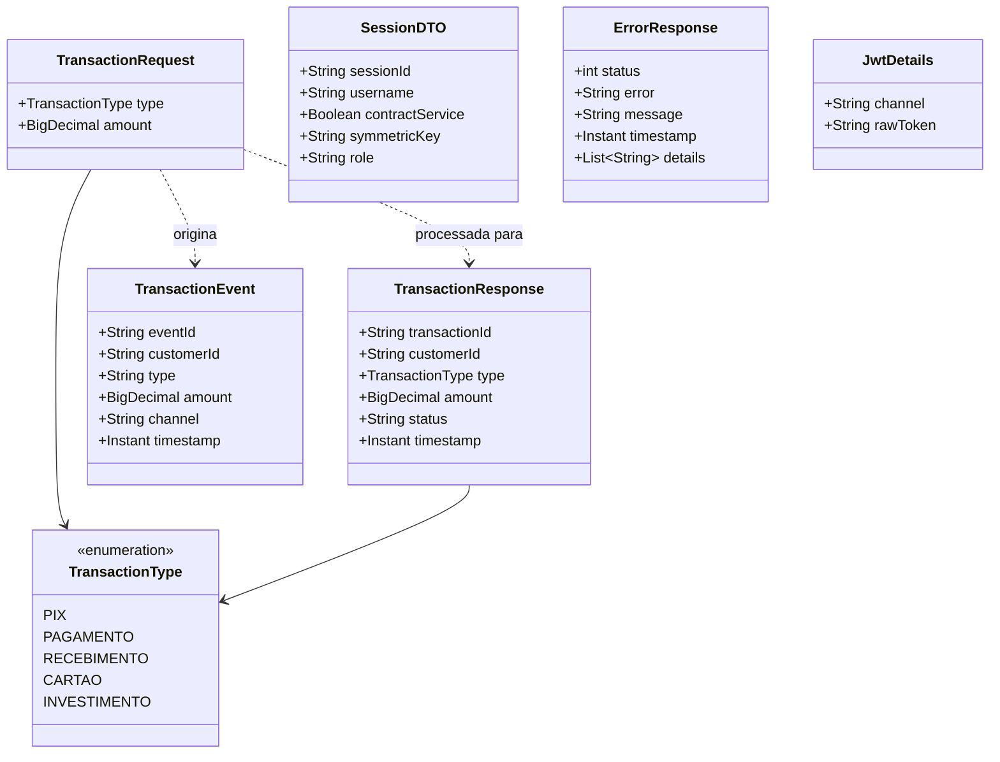
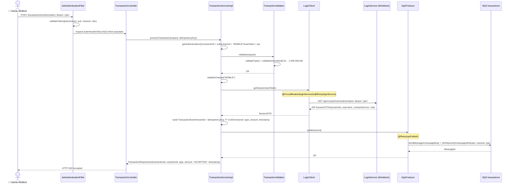
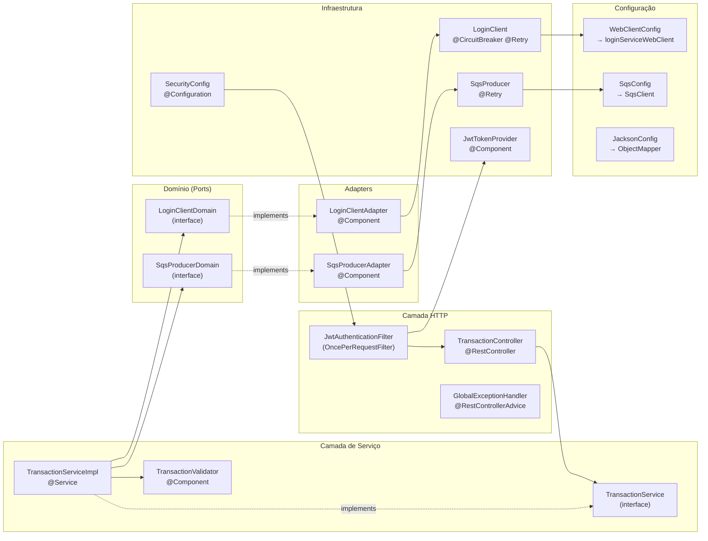

# 💳 transaction-service

<p align="center">
  
  
  
  
  
  
  
  
</p>

Microsserviço de **processamento de transações financeiras**, desenvolvido em **Java 21** com **Spring Boot 3.3.5**. Recebe requisições autenticadas via JWT, valida a sessão do cliente junto ao **LoginService**, e publica eventos de transação em uma fila **AWS SQS** (emulada localmente com LocalStack).

---

## 📑 Sumário

1. [Visão Geral do Projeto](#1-visão-geral-do-projeto)
2. [Arquitetura do Sistema](#2-arquitetura-do-sistema)
3. [Diagramas UML](#3-diagramas-uml)
4. [Serviços e Comunicação](#4-serviços-e-comunicação)
5. [Modelo de Dados](#5-modelo-de-dados)
6. [Segurança e Autenticação](#6-segurança-e-autenticação)
7. [Como Subir o Projeto (Docker)](#7-como-subir-o-projeto-docker)
8. [Testando as APIs](#8-testando-as-apis)
9. [Estrutura de Pastas](#9-estrutura-de-pastas)
10. [Variáveis de Ambiente](#10-variáveis-de-ambiente)
11. [Troubleshooting](#11-troubleshooting)
12. [Próximos Passos e Melhorias](#12-próximos-passos-e-melhorias)

---

## 1. Visão Geral do Projeto

### Nome e propósito

| Campo | Valor |
|---|---|
| **artifactId** | `transaction-service` |
| **groupId** | `com.transactionservice` |
| **version** | `1.0.0` |
| **descrição** | TransactionService – Financial Transaction Processing Microservice |

O serviço resolve o problema de **receber e validar transações financeiras de forma segura e resiliente**, garantindo que:

- Apenas clientes autenticados via JWT com canal `MOBILE` possam criar transações.
- A sessão ativa do cliente seja verificada no **LoginService** antes de qualquer processamento.
- Cada transação aceita seja publicada como evento na fila **AWS SQS** para processamento assíncrono downstream.
- O sistema se mantenha estável mesmo quando o LoginService fica temporariamente indisponível (Circuit Breaker + Retry).

### Principais funcionalidades

| Funcionalidade | Endpoint / Classe | Descrição |
|---|---|---|
| Criar transação | `POST /transactions` | Recebe e valida a transação, publica no SQS |
| Validação JWT | `JwtAuthenticationFilter` | Extrai `customerId`, `channel` e `roles` do token |
| Verificação de sessão | `LoginClient → GET /api/v1/auth/me` | Confirma sessão ativa no LoginService |
| Publicação SQS | `SqsProducer` | Envia `TransactionEvent` para a fila `transactions` |
| Circuit Breaker | Resilience4j `loginService` | Isola falhas do LoginService |
| Retry com backoff | Resilience4j `sqsPublish` | Retenta publicações SQS transientes |
| Observabilidade | `/actuator/prometheus` | Métricas de negócio e performance |
| Health Check | `/actuator/health` | Estado do serviço e Circuit Breakers |

### Tecnologias utilizadas

| Tecnologia | Versão exata | Uso |
|---|---|---|
| Java | **21** | Linguagem principal |
| Spring Boot | **3.3.5** | Framework base |
| Spring Security | via Spring Boot 3.3.5 | Autenticação JWT stateless |
| Spring WebFlux (WebClient) | via Spring Boot 3.3.5 | Chamadas HTTP reativas ao LoginService |
| Spring Validation | via Spring Boot 3.3.5 | Validação de `@Valid` no request body |
| Spring Actuator | via Spring Boot 3.3.5 | Health, metrics, prometheus |
| JJWT (jjwt-api/impl/jackson) | **0.12.6** | Parsing e validação de JWT |
| Resilience4j Spring Boot 3 | **2.2.0** | CircuitBreaker e Retry |
| AWS SDK v2 – SQS | **2.29.50** | Publicação de eventos na fila SQS |
| Micrometer + Prometheus | via Spring Boot 3.3.5 | Métricas exportáveis para Prometheus |
| Logstash Logback Encoder | **8.0** | Logs estruturados em JSON |
| Lombok | **1.18.46** | Redução de boilerplate |
| WireMock | **3.3.1** | Mock do LoginService em testes e Docker |
| LocalStack | **3.0** | Emulação local do AWS SQS |
| Docker / Docker Compose | 3.8 | Containerização e ambiente local |

---

## 2. Arquitetura do Sistema

### Diagrama de arquitetura



### Descrição de cada componente

| Componente | Container | Porta | Responsabilidade |
|---|---|---|---|
| `transaction-service` | `transaction-service` | `8080` | Núcleo do sistema: recebe, valida e encaminha transações |
| `login-service-mock` | `login-service-mock` | `8081` (ext) / `8080` (int) | Stub WireMock que simula o LoginService real |
| `localstack` | `localstack` | `4566` | Emula AWS SQS localmente |

### Padrões de arquitetura identificados

- **Arquitetura Hexagonal (Ports & Adapters)**: interfaces de domínio (`LoginClientDomain`, `SqsProducerDomain`) desacoplam o serviço das implementações de infraestrutura.
- **Stateless JWT Authentication**: sem sessão HTTP – todo estado de autenticação está no token.
- **Event-Driven**: transações aceitas viram eventos SQS para processamento assíncrono.
- **Circuit Breaker + Retry**: Resilience4j protege contra indisponibilidade do LoginService.
- **Feature Flag**: `LOGIN_SERVICE_FAIL_FAST` controla comportamento quando LoginService cai.
- **Idempotência via header**: `X-Idempotency-Key` opcional para deduplicação de eventos SQS.
- **Observabilidade**: métricas Micrometer/Prometheus + logs estruturados JSON (Logstash).

---

## 3. Diagramas UML

### 3.1 Diagrama de classes das principais entidades



### 3.2 Diagrama de sequência – fluxo completo de uma transação



### 3.3 Diagrama de componentes – camadas e filtros



---

## 4. Serviços e Comunicação

### transaction-service (porta 8080)

| Método | URL | Auth | Descrição |
|---|---|---|---|
| `POST` | `/transactions` | `Bearer JWT` (MOBILE) | Processa uma transação financeira |
| `GET` | `/actuator/health` | Público | Health check do serviço e Circuit Breakers |
| `GET` | `/actuator/info` | Público | Informações da aplicação |
| `GET` | `/actuator/prometheus` | Público | Métricas no formato Prometheus |
| `GET` | `/actuator/metrics` | Público | Métricas gerais |
| `GET` | `/actuator/circuitbreakers` | Público | Estado dos Circuit Breakers |
| `GET` | `/actuator/retries` | Público | Estado dos Retry instances |

### login-service-mock (porta 8081 → interna 8080)

| Método | URL | Auth | Resposta |
|---|---|---|---|
| `GET` | `/me` | `Bearer .+` (qualquer JWT) | `SessionDTO` com `contractService: true` |

> **Nota:** O `LoginClient` chama `GET /api/v1/auth/me` no base-url configurado. O mock WireMock em Docker está mapeado em `/me` — ajuste conforme o LoginService real.

### localstack (porta 4566)

| Serviço AWS | Recurso | URL |
|---|---|---|
| SQS | fila `transactions` | `http://localstack:4566/000000000000/transactions` |

### Fluxo de dados entre serviços

```
Cliente MOBILE
    │
    │ POST /transactions  +  Authorization: Bearer JWT
    ▼
transaction-service (:8080)
    │
    ├─── GET /api/v1/auth/me ──────────────────────► login-service (:8081)
    │         Authorization: Bearer JWT                     │
    │◄────────────── SessionDTO ──────────────────────────◄─┘
    │
    └─── SendMessage (JSON) ──────────────────────► SQS fila transactions (:4566)
```

**Protocolo de comunicação com LoginService:** HTTP/1.1 síncrono via WebClient (Netty), com timeout de 2000ms, Circuit Breaker e Retry.

**Protocolo com SQS:** AWS SDK v2 síncrono (`sqsClient.sendMessage()`), com Retry em caso de falha transitória.

---

## 5. Modelo de Dados

O `transaction-service` **não possui banco de dados**. Toda a persistência é delegada para downstream via SQS. As estruturas de dados são Java records (imutáveis).

### TransactionRequest (entrada da API)

```json
{
  "type": "PIX",
  "amount": 500.00
}
```

| Campo | Tipo Java | Validação |
|---|---|---|
| `type` | `TransactionType` (enum) | `@NotNull` |
| `amount` | `BigDecimal` | `@NotNull`, `@DecimalMin("0.01")` |

Validação adicional em `TransactionValidator`: `amount` ≤ `1000000.00`

### TransactionType (enum)

```
PIX | PAGAMENTO | RECEBIMENTO | CARTAO | INVESTIMENTO
```

### TransactionResponse (saída da API – HTTP 202)

```json
{
  "transactionId": "550e8400-e29b-41d4-a716-446655440000",
  "customerId": "customer-123",
  "type": "PIX",
  "amount": 500.00,
  "status": "ACCEPTED",
  "timestamp": "2025-04-28T05:12:45.923Z"
}
```

### TransactionEvent (mensagem publicada no SQS)

```json
{
  "eventId": "550e8400-e29b-41d4-a716-446655440000",
  "customerId": "customer-123",
  "type": "PIX",
  "amount": 500.00,
  "channel": "MOBILE",
  "timestamp": "2025-04-28T05:12:45.923Z"
}
```

Mensagem SQS também inclui `messageAttributes`:
- `channel` (String): ex. `"MOBILE"`
- `type` (String): ex. `"PIX"`

> **Idempotência:** Se o header `X-Idempotency-Key` for informado, ele é usado como `eventId` (e como `messageDeduplicationId` em filas FIFO).

### SessionDTO (resposta do LoginService)

```json
{
  "sessionId": "mock-session-id",
  "username": "mock-customer",
  "contractService": true,
  "symmetricKey": "mock-symmetric-key",
  "role": "USER"
}
```

### ErrorResponse (corpo de erros)

```json
{
  "status": 422,
  "error": "Business Rule Violation",
  "message": "Channel 'WEB' is not allowed. Only MOBILE transactions are accepted.",
  "timestamp": "2025-04-28T05:12:45.923Z",
  "details": []
}
```

---

## 6. Segurança e Autenticação

### Fluxo JWT completo

```
1. LoginService (externo) gera o JWT com as claims:
   - sub     : customerId (ex: "customer-123")
   - channel : canal de origem (ex: "MOBILE")
   - roles   : lista de perfis (ex: ["USER"])
   - iat     : issued at (unix timestamp)
   - exp     : expiração

2. Cliente inclui o token no header:
   Authorization: Bearer <jwt>

3. JwtAuthenticationFilter intercepta TODA requisição:
   a) Extrai o token do header Authorization (remove "Bearer ")
   b) Chama JwtTokenProvider.validateToken(token)
      - Faz parse do JWT com a SecretKey (HMAC-SHA)
      - Verifica se não está expirado
   c) Se válido:
      - getSubject(token)  → customerId (principal)
      - getChannel(token)  → claim "channel"
      - getRoles(token)    → claim "roles" (list)
      - Cria UsernamePasswordAuthenticationToken com authorities ROLE_USER
      - Armazena JwtDetails(channel, rawToken) em authentication.details
      - Popula SecurityContextHolder

4. TransactionServiceImpl lê o SecurityContext:
   - customerId = authentication.getPrincipal()
   - channel    = jwtDetails.channel()
   - rawToken   = jwtDetails.rawToken()

5. Validação de canal:
   - Apenas channel == "MOBILE" (case-insensitive) é aceito
   - Qualquer outro canal → BusinessException (HTTP 422)

6. O rawToken é encaminhado ao LoginClient para verificar sessão ativa
```

### Configuração do JWT

| Parâmetro | Valor |
|---|---|
| Algoritmo de assinatura | HMAC-SHA (escolhido automaticamente pelo JJWT com base no tamanho da chave) |
| Secret (env) | `JWT_SECRET=bXlTdXBlclNlY3JldEtleUZvckpXVFRva2VuR2VuZXJhdGlvbjEyMzQ1Njc4OTA=` |
| Encoding do secret | String UTF-8 direta (`secret.getBytes(StandardCharsets.UTF_8)`) |
| Expiração | Verificada pela claim `exp` |

### Filtros de segurança

| Filtro / Configuração | Classe | Comportamento |
|---|---|---|
| `JwtAuthenticationFilter` | `OncePerRequestFilter` | Intercepta toda requisição, extrai e valida JWT |
| `SecurityConfig` | `@EnableWebSecurity` | CSRF desabilitado (API stateless); sessão `STATELESS` |
| Regras de acesso | `SecurityFilterChain` | `/actuator/health`, `/actuator/info`, `/actuator/prometheus` → público; todo o resto → autenticado |

### Circuit Breaker (LoginService)

| Parâmetro | Valor |
|---|---|
| Janela deslizante | 10 chamadas |
| Mínimo de chamadas para avaliar | 5 |
| Threshold de falhas | 50% |
| Tempo em estado OPEN | 30 segundos |
| Chamadas permitidas em HALF-OPEN | 3 |
| Transição automática OPEN → HALF-OPEN | habilitada |
| Exceções que contam como falha | `IOException`, `TimeoutException`, `WebClientRequestException`, `LoginServiceUnavailableException` |

### Retry (LoginService)

| Parâmetro | Valor |
|---|---|
| Máximo de tentativas | 3 |
| Espera inicial | 500ms |
| Backoff exponencial | 2× |
| Exceções retentáveis | `IOException`, `TimeoutException`, `WebClientRequestException` |
| Exceções ignoradas (não retenta) | `BusinessException`, `UnauthorizedException` |

### Retry (SQS)

| Parâmetro | Valor |
|---|---|
| Máximo de tentativas | 3 |
| Espera inicial | 500ms |
| Backoff exponencial | 2× |
| Exceções retentáveis | `IOException`, `TimeoutException`, `SdkClientException` |
| Exceções ignoradas | `BusinessException` |

### Fail-Fast vs Fail-Open

Controlado pela variável `LOGIN_SERVICE_FAIL_FAST`:

| Modo | Comportamento |
|---|---|
| `true` (padrão) | Se o LoginService cair (fallback), a transação é **bloqueada** → `LoginServiceUnavailableException` → HTTP 503 |
| `false` | Se o LoginService cair, a transação é **permitida** sem validação de sessão (Fail-Open) |

---

## 7. Como Subir o Projeto (Docker)

### Pré-requisitos

- [Docker Engine](https://docs.docker.com/engine/install/) ≥ 20.x
- [Docker Compose](https://docs.docker.com/compose/install/) ≥ 2.x (plugin ou standalone)
- Porta `8080`, `8081` e `4566` livres na máquina

### Serviços provisionados pelo docker-compose.yml

| Serviço | Imagem | Porta | Dependências |
|---|---|---|---|
| `transaction-service` | build local (Dockerfile) | `8080` | `localstack` (healthy), `login-service-mock` (started) |
| `localstack` | `localstack/localstack:3.0` | `4566` | — |
| `login-service-mock` | `wiremock/wiremock:3.3.1` | `8081` | — |

### Passo a passo

**1. Clone e entre na pasta do projeto**

```bash
git clone https://github.com/ThiagoCintra/TransactionService.git
cd TransactionService
```

**2. Suba o ambiente completo**

```bash
docker compose up --build
```

> O LocalStack inicializa automaticamente a fila SQS via `scripts/localstack-init.sh`:
> ```bash
> awslocal sqs create-queue --queue-name transactions --region us-east-1
> ```

**3. Aguarde o health check**

O `transaction-service` ficará `healthy` após o endpoint `/actuator/health` retornar 200. Isso pode levar até 60 segundos na primeira vez (build Maven incluído).

```bash
# Acompanhar os logs de todos os serviços
docker compose logs -f

# Verificar status dos containers
docker compose ps
```

**4. Confirmar que tudo está rodando**

```bash
curl http://localhost:8080/actuator/health
# Esperado: {"status":"UP",...}

curl http://localhost:4566/_localstack/health
# Esperado: {"services":{"sqs":"available"},...}
```

### Comandos úteis

```bash
# Subir somente LocalStack e WireMock (dev local sem Docker para o serviço)
docker compose up localstack login-service-mock

# Reiniciar somente o transaction-service após mudanças
docker compose up --build transaction-service

# Ver logs do transaction-service em tempo real
docker compose logs -f transaction-service

# Parar todos os containers
docker compose down

# Parar e remover volumes
docker compose down -v

# Executar comando dentro do container localstack
docker compose exec localstack bash

# Listar mensagens na fila SQS (dentro do localstack)
docker compose exec localstack awslocal sqs receive-message \
  --queue-url http://localhost:4566/000000000000/transactions \
  --region us-east-1

# Recriar a fila SQS manualmente (se necessário)
docker compose exec localstack awslocal sqs create-queue \
  --queue-name transactions \
  --region us-east-1
```

### Build e teste sem Docker

```bash
# Build (pula testes)
mvn clean package -DskipTests

# Executar os testes
mvn test -Dspring.profiles.active=test

# Rodar a aplicação localmente (LocalStack e WireMock devem estar up)
java -jar target/transaction-service-1.0.0.jar \
  --JWT_SECRET=bXlTdXBlclNlY3JldEtleUZvckpXVFRva2VuR2VuZXJhdGlvbjEyMzQ1Njc4OTA= \
  --LOGIN_SERVICE_URL=http://localhost:8081 \
  --SQS_QUEUE_URL=http://localhost:4566/000000000000/transactions \
  --AWS_ENDPOINT=http://localhost:4566
```

---

## 8. Testando as APIs

### Gerar um JWT de teste

O `JwtTokenProvider` valida o token usando os **bytes UTF-8** do segredo. Use o script Python abaixo para gerar um token compatível:

```python
# pip install PyJWT
import jwt
import time

secret = "bXlTdXBlclNlY3JldEtleUZvckpXVFRva2VuR2VuZXJhdGlvbjEyMzQ1Njc4OTA="

payload = {
    "sub": "customer-123",
    "channel": "MOBILE",
    "roles": ["USER"],
    "iat": int(time.time()),
    "exp": int(time.time()) + 3600
}

# A chave deve ser os bytes UTF-8 do secret (não Base64-decoded)
token = jwt.encode(payload, secret.encode("utf-8"), algorithm="HS512")
print(token)
```

> **Atenção:** Para testes de integração (`mvn test`), use a classe `JwtTestHelper.generateMobileToken("customer-123")` que já está corretamente configurada para o perfil de teste.

---

### Endpoint: `POST /transactions`

**Requisição – PIX de R$ 500,00**

```bash
TOKEN="<cole_o_jwt_gerado_acima>"

curl -X POST http://localhost:8080/transactions \
  -H "Content-Type: application/json" \
  -H "Authorization: Bearer $TOKEN" \
  -d '{
    "type": "PIX",
    "amount": 500.00
  }'
```

**Resposta esperada – HTTP 202 Accepted**

```json
{
  "transactionId": "550e8400-e29b-41d4-a716-446655440000",
  "customerId": "customer-123",
  "type": "PIX",
  "amount": 500.00,
  "status": "ACCEPTED",
  "timestamp": "2025-04-28T05:12:45.923Z"
}
```

---

**Requisição com Idempotency Key**

```bash
curl -X POST http://localhost:8080/transactions \
  -H "Content-Type: application/json" \
  -H "Authorization: Bearer $TOKEN" \
  -H "X-Idempotency-Key: 7f3a9b1c-2d4e-5f6a-7b8c-9d0e1f2a3b4c" \
  -d '{
    "type": "PAGAMENTO",
    "amount": 150.50
  }'
```

---

**Todos os tipos de transação válidos**

```bash
for TYPE in PIX PAGAMENTO RECEBIMENTO CARTAO INVESTIMENTO; do
  echo "--- $TYPE ---"
  curl -s -X POST http://localhost:8080/transactions \
    -H "Content-Type: application/json" \
    -H "Authorization: Bearer $TOKEN" \
    -d "{\"type\": \"$TYPE\", \"amount\": 100.00}" | python3 -m json.tool
done
```

---

### Respostas de erro documentadas

**HTTP 401 – Sem token**

```bash
curl -X POST http://localhost:8080/transactions \
  -H "Content-Type: application/json" \
  -d '{"type": "PIX", "amount": 100.00}'
```

```
HTTP/1.1 401 Unauthorized
```

---

**HTTP 400 – Valor inválido (negativo)**

```bash
curl -X POST http://localhost:8080/transactions \
  -H "Content-Type: application/json" \
  -H "Authorization: Bearer $TOKEN" \
  -d '{"type": "PIX", "amount": -100.00}'
```

```json
{
  "status": 400,
  "error": "Validation Error",
  "message": "Request validation failed",
  "timestamp": "2025-04-28T05:12:45.923Z",
  "details": ["Amount must be greater than zero"]
}
```

---

**HTTP 422 – Canal não é MOBILE**

```json
{
  "status": 422,
  "error": "Business Rule Violation",
  "message": "Channel 'WEB' is not allowed. Only MOBILE transactions are accepted.",
  "timestamp": "2025-04-28T05:12:45.923Z",
  "details": []
}
```

---

**HTTP 422 – Valor acima do máximo (R$ 1.000.000,00)**

```bash
curl -X POST http://localhost:8080/transactions \
  -H "Content-Type: application/json" \
  -H "Authorization: Bearer $TOKEN" \
  -d '{"type": "INVESTIMENTO", "amount": 2000000.00}'
```

```json
{
  "status": 422,
  "error": "Business Rule Violation",
  "message": "Transaction amount exceeds maximum allowed value of 1000000.00",
  "timestamp": "2025-04-28T05:12:45.923Z",
  "details": []
}
```

---

**HTTP 503 – LoginService indisponível**

```json
{
  "status": 503,
  "error": "Service Unavailable",
  "message": "Authentication service is temporarily unavailable. Please try again later.",
  "timestamp": "2025-04-28T05:12:45.923Z",
  "details": []
}
```

---

### Endpoints do Actuator

```bash
# Health com estado do Circuit Breaker
curl http://localhost:8080/actuator/health

# Métricas Prometheus (scraping)
curl http://localhost:8080/actuator/prometheus | grep "transactions"

# Estado dos Circuit Breakers
curl http://localhost:8080/actuator/circuitbreakers

# Métrica específica
curl http://localhost:8080/actuator/metrics/transactions.total
curl http://localhost:8080/actuator/metrics/login.service.request.duration
```

---

### Configuração Postman

Importe a coleção abaixo no Postman (salve como `TransactionService.postman_collection.json`):

```json
{
  "info": {
    "name": "transaction-service",
    "schema": "https://schema.getpostman.com/json/collection/v2.1.0/collection.json"
  },
  "variable": [
    { "key": "base_url", "value": "http://localhost:8080" },
    { "key": "token", "value": "" }
  ],
  "item": [
    {
      "name": "POST /transactions - PIX",
      "request": {
        "method": "POST",
        "url": "{{base_url}}/transactions",
        "header": [
          { "key": "Content-Type", "value": "application/json" },
          { "key": "Authorization", "value": "Bearer {{token}}" }
        ],
        "body": {
          "mode": "raw",
          "raw": "{\n  \"type\": \"PIX\",\n  \"amount\": 500.00\n}"
        }
      }
    },
    {
      "name": "GET /actuator/health",
      "request": {
        "method": "GET",
        "url": "{{base_url}}/actuator/health"
      }
    },
    {
      "name": "GET /actuator/prometheus",
      "request": {
        "method": "GET",
        "url": "{{base_url}}/actuator/prometheus"
      }
    }
  ]
}
```

---

## 9. Estrutura de Pastas

```
TransactionService/
├── Dockerfile                          # Build multi-stage: Maven 3.9.9 + Eclipse Temurin 21
├── docker-compose.yml                  # Orquestração: transaction-service + localstack + wiremock
├── pom.xml                             # Dependências Maven (Java 21, Spring Boot 3.3.5)
├── scripts/
│   └── localstack-init.sh              # Cria a fila SQS 'transactions' no LocalStack na inicialização
├── wiremock/
│   └── mappings/
│       └── login-service.json          # Stub: GET /me → SessionDTO com contractService: true
└── src/
    ├── main/
    │   ├── java/com/transactionservice/
    │   │   ├── TransactionServiceApplication.java     # @SpringBootApplication – ponto de entrada
    │   │   │
    │   │   ├── controller/
    │   │   │   ├── TransactionController.java          # @RestController POST /transactions
    │   │   │   └── GlobalExceptionHandler.java         # @RestControllerAdvice – mapeamento de exceções → HTTP
    │   │   │
    │   │   ├── service/
    │   │   │   ├── TransactionService.java             # Interface: processTransaction(request, idempotencyKey)
    │   │   │   ├── TransactionServiceImpl.java         # Implementação: orquestra validação, sessão e SQS
    │   │   │   └── TransactionValidator.java           # Valida tipo (not null) e valor (0.01..1.000.000)
    │   │   │
    │   │   ├── domain/
    │   │   │   └── TransactionType.java                # Enum: PIX, PAGAMENTO, RECEBIMENTO, CARTAO, INVESTIMENTO
    │   │   │
    │   │   ├── domains/                                # Interfaces de domínio (Ports – Hexagonal)
    │   │   │   ├── LoginClientDomain.java              # Port: getSession(token) → SessionDTO
    │   │   │   └── SqsProducerDomain.java              # Port: publish(event)
    │   │   │
    │   │   ├── adapters/                               # Adapters que implementam os Ports
    │   │   │   ├── LoginClientAdapter.java             # Delega para LoginClient (infra)
    │   │   │   └── SqsProducerAdapter.java             # Delega para SqsProducer (infra)
    │   │   │
    │   │   ├── model/
    │   │   │   ├── request/
    │   │   │   │   └── TransactionRequest.java         # Record: type + amount (validação Bean)
    │   │   │   ├── response/
    │   │   │   │   ├── TransactionResponse.java        # Record: transactionId, customerId, type, amount, status, timestamp
    │   │   │   │   └── ErrorResponse.java              # Record: status, error, message, timestamp, details
    │   │   │   ├── event/
    │   │   │   │   └── TransactionEvent.java           # Record: eventId, customerId, type, amount, channel, timestamp
    │   │   │   └── session/
    │   │   │       └── SessionDTO.java                 # Record: sessionId, username, contractService, symmetricKey, role
    │   │   │
    │   │   ├── exception/
    │   │   │   ├── BusinessException.java              # Regra de negócio violada → HTTP 422
    │   │   │   ├── UnauthorizedException.java          # Não autenticado → HTTP 401
    │   │   │   └── LoginServiceUnavailableException.java # LoginService fora → HTTP 503
    │   │   │
    │   │   ├── infrastructure/
    │   │   │   ├── client/
    │   │   │   │   └── LoginClient.java                # WebClient + @CircuitBreaker + @Retry → GET /api/v1/auth/me
    │   │   │   ├── security/
    │   │   │   │   ├── SecurityConfig.java             # SecurityFilterChain: JWT stateless, CSRF off
    │   │   │   │   ├── JwtAuthenticationFilter.java    # OncePerRequestFilter: extrai sub/channel/roles
    │   │   │   │   ├── JwtTokenProvider.java           # Parse e validação JWT com HMAC-SHA
    │   │   │   │   └── JwtDetails.java                 # Record: channel + rawToken (armazenado em authentication.details)
    │   │   │   └── sqs/
    │   │   │       └── SqsProducer.java                # SqsClient.sendMessage() + @Retry + métricas Micrometer
    │   │   │
    │   │   └── config/
    │   │       ├── WebClientConfig.java                # Bean 'loginServiceWebClient' com timeouts Netty
    │   │       ├── SqsConfig.java                      # Bean SqsClient (credenciais + endpoint override)
    │   │       └── JacksonConfig.java                  # ObjectMapper: JavaTimeModule, ISO dates, ignora campos extras
    │   │
    │   └── resources/
    │       └── application.yml                         # Configuração principal (secrets via env vars)
    │
    └── test/
        ├── java/com/transactionservice/
        │   ├── JwtTestHelper.java                      # Gera tokens JWT para testes (Base64-decode do secret)
        │   ├── controller/
        │   │   └── TransactionControllerIntegrationTest.java  # @SpringBootTest + WireMock + MockMvc
        │   ├── service/
        │   │   └── TransactionServiceTest.java         # Testes unitários com Mockito
        │   └── validator/
        │       └── TransactionValidatorTest.java       # Testes unitários do TransactionValidator
        └── resources/
            └── application-test.yml                    # Perfil de teste: WireMock dinâmico, SQS sem endpoint
```

---

## 10. Variáveis de Ambiente

Todas as variáveis são lidas em `application.yml` com suporte a defaults.

| Variável | Valor no docker-compose.yml | Default em application.yml | Descrição |
|---|---|---|---|
| `JWT_SECRET` | `bXlTdXBlclNlY3JldEtleUZvckpXVFRva2VuR2VuZXJhdGlvbjEyMzQ1Njc4OTA=` | *(obrigatório)* | Segredo para validação JWT (bytes UTF-8) |
| `LOGIN_SERVICE_URL` | `http://login-service-mock:8081` | `http://login-service:8081` | URL base do LoginService |
| `LOGIN_SERVICE_TIMEOUT_MILLIS` | *(não definido)* | `2000` | Timeout das chamadas ao LoginService (ms) |
| `LOGIN_SERVICE_FAIL_FAST` | `true` | `true` | Bloqueia transação se LoginService cair |
| `SQS_QUEUE_URL` | `http://localstack:4566/000000000000/transactions` | *(obrigatório)* | URL completa da fila SQS |
| `AWS_REGION` | `us-east-1` | `us-east-1` | Região AWS |
| `AWS_ENDPOINT` | `http://localstack:4566` | `http://localstack:4566` | Endpoint SQS (override para LocalStack) |
| `AWS_ACCESS_KEY_ID` | `test` | `test` | Access Key AWS |
| `AWS_SECRET_ACCESS_KEY` | `test` | `test` | Secret Key AWS |
| `SPRING_PROFILES_ACTIVE` | `docker` | *(não definido)* | Perfil Spring ativo |

### Resilience4j (application.yml – não sobrescritos por env)

| Configuração | Valor |
|---|---|
| `resilience4j.circuitbreaker.instances.loginService.sliding-window-size` | `10` |
| `resilience4j.circuitbreaker.instances.loginService.failure-rate-threshold` | `50` |
| `resilience4j.circuitbreaker.instances.loginService.wait-duration-in-open-state` | `30s` |
| `resilience4j.retry.instances.loginService.max-attempts` | `3` |
| `resilience4j.retry.instances.loginService.wait-duration` | `500ms` |
| `resilience4j.retry.instances.sqsPublish.max-attempts` | `3` |
| `resilience4j.retry.instances.sqsPublish.wait-duration` | `500ms` |

---

## 11. Troubleshooting

### ❌ HTTP 401 Unauthorized ao chamar `POST /transactions`

**Causas possíveis:**

1. **Token ausente** – verifique se o header `Authorization: Bearer <token>` está presente.
2. **Token expirado** – a claim `exp` é menor que `now()`. Gere um novo token.
3. **Assinatura inválida** – o token foi assinado com um secret diferente de `JWT_SECRET`. Confirme que o secret UTF-8 do token corresponde ao valor da variável `JWT_SECRET` da aplicação.
4. **Formato incorreto** – o header deve ser exatamente `Bearer ` + token (com espaço).

**Verificação:**

```bash
# Verificar se o serviço está rodando
curl http://localhost:8080/actuator/health

# Decodificar o JWT (sem verificar assinatura) para inspecionar claims
# https://jwt.io ou:
echo "<TOKEN>" | cut -d'.' -f2 | base64 -d 2>/dev/null | python3 -m json.tool
```

---

### ❌ HTTP 422 – "Channel 'X' is not allowed"

O JWT deve conter a claim `"channel": "MOBILE"` (case-insensitive). Qualquer outro valor (ex: `"WEB"`, `"DESKTOP"`) é rejeitado por `TransactionServiceImpl.validateChannel()`.

---

### ❌ HTTP 503 – "Authentication service is temporarily unavailable"

O Circuit Breaker do `LoginClient` está aberto ou o fallback foi acionado com `LOGIN_SERVICE_FAIL_FAST=true`.

**Diagnóstico:**

```bash
# Verificar estado do Circuit Breaker
curl http://localhost:8080/actuator/circuitbreakers

# Verificar se o WireMock está respondendo
curl http://localhost:8081/me -H "Authorization: Bearer qualquer-token"

# Logs do transaction-service
docker compose logs transaction-service | grep -i "circuit\|fallback\|loginservice"
```

**Solução:** Aguarde 30 segundos (tempo de OPEN state) para o Circuit Breaker ir para HALF-OPEN, ou reinicie o `login-service-mock`.

---

### ❌ SQS: `QueueDoesNotExist`

A fila `transactions` não foi criada no LocalStack.

**Solução:**

```bash
# Verificar se a fila existe
docker compose exec localstack awslocal sqs list-queues --region us-east-1

# Criar a fila manualmente
docker compose exec localstack awslocal sqs create-queue \
  --queue-name transactions \
  --region us-east-1

# Verificar logs do init script
docker compose logs localstack | grep -i "transactions\|init"
```

---

### ❌ JWT signature does not match / JWT_SECRET mismatch

O `JwtTokenProvider` usa **os bytes UTF-8 do valor bruto de `JWT_SECRET`** (não decodifica Base64). Certifique-se de que o gerador do token usa o mesmo mecanismo:

```python
# CORRETO: bytes UTF-8 do secret
key = secret.encode("utf-8")

# ERRADO (não use):
key = base64.b64decode(secret)
```

Para o ambiente de teste (`mvn test`), o `JwtTestHelper` usa `Base64.getDecoder().decode(SECRET)` — válido apenas no contexto dos testes, não para tokens do Docker.

---

### ❌ `Connection refused` ao LocalStack

Verifique se o LocalStack subiu corretamente:

```bash
curl http://localhost:4566/_localstack/health
docker compose ps localstack
docker compose logs localstack
```

Se o health check falhar, tente:

```bash
docker compose down -v
docker compose up localstack
```

---

### ❌ `transaction-service` não sobe / OOMKilled

O build Maven dentro do Docker pode precisar de mais memória.

```bash
# Adicionar MAVEN_OPTS ao build
docker compose build --build-arg MAVEN_OPTS="-Xmx512m" transaction-service
```

---

## 12. Próximos Passos e Melhorias

Com base no código existente, as seguintes melhorias são sugeridas:

### 🔒 Segurança

- **Ativar validação de `contractService`**: O bloco de código em `TransactionServiceImpl.fetchAndValidateSession()` que rejeita clientes sem `contractService = true` está comentado. Avaliar ativação conforme regra de negócio.
- **Rotação de JWT_SECRET**: Implementar suporte a múltiplos secrets para rotação sem downtime.
- **Rate Limiting**: Adicionar filtro de rate limit por `customerId` para evitar abuso da API.

### 📊 Observabilidade

- **Distributed Tracing**: Integrar OpenTelemetry / Zipkin para rastrear requisições entre `transaction-service` e `LoginService`.
- **Alertas Prometheus**: Configurar alertas para `transactions.failures` acima de threshold e Circuit Breaker em estado OPEN.
- **Structured Logging**: Adicionar `traceId` e `spanId` nos logs JSON para correlação entre serviços.

### 🏗️ Arquitetura

- **Dead Letter Queue (DLQ)**: Configurar DLQ no SQS para mensagens que falharam após todas as retentativas, evitando perda de eventos.
- **Fila FIFO**: Para garantia de ordem por cliente (`customerId`), migrar para SQS FIFO. O código já suporta (`fifoQueue` flag no `SqsProducer`).
- **Persistência de auditoria**: Adicionar persistência em banco de dados (PostgreSQL ou DynamoDB) para rastreabilidade de todas as transações processadas.
- **Consumer SQS**: Implementar o consumidor da fila `transactions` como serviço separado para completar o fluxo event-driven.

### 🧪 Testes

- **Testes de contrato**: Adicionar Pact (Consumer-Driven Contract) entre `transaction-service` e `LoginService` para garantir compatibilidade de interface.
- **Testes de carga**: Implementar testes com Gatling ou k6 para validar comportamento sob carga e o Circuit Breaker.
- **Cobertura**: Aumentar cobertura dos testes de integração com cenários de timeout e partial failures no LoginService.

### 🐳 Infraestrutura

- **Kubernetes / Helm**: Adicionar manifests K8s ou chart Helm para deploy em produção.
- **CI/CD**: Pipeline GitHub Actions com build, test, análise estática (SonarQube) e push de imagem para registry.
- **Secrets Management**: Substituir variáveis de ambiente por integração com AWS Secrets Manager ou HashiCorp Vault.

---

## 📝 Licença

Este projeto é de uso interno e fins educacionais.
